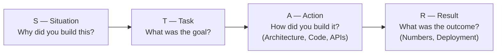
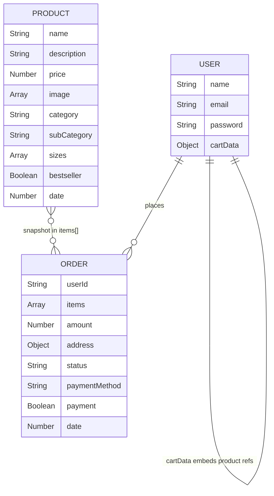

# 🛒 SmartCart — Complete Single Speaking Script (STAR Methodology)

> [!IMPORTANT]
> This is a **single, unified script** you can say as-is in your interview. It covers the entire SmartCart project using STAR methodology, with every API endpoint, JWT auth, admin panel, client pages, and payment flows explained in speaking order.

---

## 🎯 STAR METHODOLOGY — How It Maps to SmartCart

Before the script, understand the framework:



| STAR Block | What You Cover | Time |
|------------|---------------|------|
| **S** — Situation | The real-world problem | ~15 sec |
| **T** — Task | Specific goals & requirements | ~15 sec |
| **A** — Action | Architecture, APIs, Auth, Payments, Frontend, Admin | ~3-4 min |
| **R** — Result | Numbers, deployment, learnings | ~30 sec |

> [!TIP]
> The **Action** block is the longest — that's where you show depth. The interviewer will interrupt with questions here, and that's GOOD — it means they're interested.

---

## 📝 THE COMPLETE SCRIPT

---

### 🔷 S — SITUATION (Say This First)

> "Thank you. I'd like to talk about **SmartCart**, my primary project.
>
> The **situation** was this — I wanted to challenge myself by building a real-world project that covers **end-to-end software development** — from database design to user authentication to payment processing to deployment. Not a tutorial clone, but something that solves a genuine business problem: **how do you sell products online securely and reliably?**"

---

### 🔷 T — TASK (What Was the Goal?)

> "The **task** I set for myself was to create a **production-grade online shopping platform** with these specific requirements:
>
> 1. User authentication with **secure password hashing and JWT tokens**
> 2. A full **product catalog** with image uploads to a CDN
> 3. A **shopping cart** that persists across sessions
> 4. **Three payment methods** — Cash on Delivery, Stripe, and Razorpay
> 5. A **separate admin dashboard** for managing products and orders
> 6. **Deployment** on Vercel with environment-based configuration
>
> Basically — everything a real e-commerce business needs to operate."

---

### 🔷 A — ACTION (The Big Section — Architecture + Code + APIs)

> "Now let me walk you through **how I built it**. I'll cover the architecture, then go through each major feature."

---

#### 📐 A1: THREE-TIER ARCHITECTURE

> "I followed a **3-tier architecture** with clear separation of concerns.
>
> **Tier 1 — Presentation Layer:** Two separate React applications built with Vite.
> - The **Customer Frontend** runs on port 5173 — this is what shoppers see. It has 12 pages: Home, Collection, Product Detail, Cart, Checkout, Orders, Login, Verify Payment, About, Contact, Privacy Policy, and Delivery Information.
> - The **Admin Dashboard** runs on port 5174 — this is completely isolated. It has 3 pages: Add Products, List Products, and Manage Orders.
> - Both communicate with the backend through **Axios HTTP calls** with JSON payloads.
>
> **Tier 2 — Business Logic Layer:** An **Express.js REST API** running on port 4000. It has **4 route modules** mounted on the server:
> - `/api/user` — for authentication (register, login, admin login)
> - `/api/product` — for catalog management (add, list, remove, single)
> - `/api/cart` — for shopping cart operations (add, update, get)
> - `/api/order` — for checkout and payments (place, verify, user orders, admin orders, status update)
>
> Every protected route goes through **JWT middleware** before reaching the controller.
>
> **Tier 3 — Data Layer:** Three external services:
> - **MongoDB Atlas** for persistent database storage
> - **Cloudinary CDN** for product image hosting
> - **Stripe and Razorpay APIs** for payment processing"

**IF ASKED: "Why separate the admin from the frontend?"**

> "Two reasons: **Security** — admin functionality is completely isolated, so even if someone discovers the admin URL, they can't access it without the admin JWT token. And **Scalability** — I can deploy them independently. If customer traffic spikes, I can scale the frontend without touching the admin."

---

#### 🔐 A2: JWT AUTHENTICATION SYSTEM (Dual Middleware)

> "I implemented a **stateless JWT-based authentication system** with **two separate middleware chains** — one for regular users and one for admins.
>
> **How User Authentication Works:**
>
> **Step 1 — Registration** (POST `/api/user/register`):
> When a user registers, I first check if the email already exists using `findOne()`. Then I validate the email format using the `validator.js` library. Then — and this is the **security-critical** part — I generate a **salt** using `bcrypt.genSalt(10)`. The number 10 is the cost factor, meaning bcrypt runs **2^10 = 1024 hashing iterations**. Then `bcrypt.hash()` combines the salt with the password to produce a **one-way hash**. Even if the database is compromised, attackers **cannot reverse** the hash to get the original password. Finally, I save the user with the hashed password and return a JWT token — so the user is **immediately logged in** after registration.
>
> **Step 2 — Login** (POST `/api/user/login`):
> I find the user by email, then use `bcrypt.compare()` to check the entered password against the stored hash. If it matches, I generate a fresh JWT token using `jwt.sign()` — it takes the user's MongoDB ObjectId as payload and signs it with our server's secret key. The frontend stores this token in **localStorage** and sends it in the request header for every subsequent API call.
>
> **Step 3 — Auth Middleware** (`authUser`):
> This middleware sits **between the route and the controller**. It extracts the token from request headers, verifies it using `jwt.verify()` with our secret key, extracts the `userId` from the decoded payload, and **injects it into `req.body.userId`**. Then `next()` passes control to the actual controller. This pattern means **every protected controller automatically has access to the authenticated user's ID** without any extra code.
>
> **How Admin Authentication Works — SEPARATELY:**
>
> **Admin Login** (POST `/api/user/admin`):
> The admin credentials are stored in **environment variables** — not in the database. When the admin logs in, I compare the entered email and password against `process.env.ADMIN_EMAIL` and `process.env.ADMIN_PASSWORD`. If they match, I sign the **concatenation of email + password** as the JWT payload — this is intentionally **different from the user token structure**.
>
> **Admin Middleware** (`adminAuth`):
> This middleware verifies the admin token and checks if the decoded value matches the concatenation of admin email + password from environment variables. If it doesn't match, the request is **rejected immediately**.
>
> This gives me **role-based access control** with **two completely separate middleware chains**. A user token **cannot** pass the admin middleware, and vice versa."

---

#### 📦 A3: ALL 18 API ENDPOINTS (The Complete API Surface)

> "The backend has **18 REST API endpoints** across 4 route modules. Let me walk you through them:"

> "**USER ROUTES** (3 endpoints):
> 1. `POST /api/user/register` — Creates new user with hashed password, returns JWT
> 2. `POST /api/user/login` — Validates credentials with bcrypt.compare(), returns JWT
> 3. `POST /api/user/admin` — Admin login with environment variable credentials, returns admin JWT
>
> **PRODUCT ROUTES** (4 endpoints):
> 4. `POST /api/product/add` — **Admin only** — Goes through `adminAuth` → `multer` (file upload) → `addProduct` controller. Uploads up to 4 images to Cloudinary in parallel using `Promise.all()`, stores the CDN URLs in MongoDB
> 5. `POST /api/product/remove` — **Admin only** — Deletes a product by ID
> 6. `POST /api/product/single` — Fetches a single product by ID (for product detail page)
> 7. `GET /api/product/list` — **Public, no auth** — Returns all products. No middleware because any visitor should browse the catalog
>
> **CART ROUTES** (3 endpoints, all protected with `authUser`):
> 8. `POST /api/cart/add` — Adds an item with specific size to the user's cart (nested hashmap structure)
> 9. `POST /api/cart/update` — Updates the quantity of a specific item+size combination
> 10. `POST /api/cart/get` — Retrieves the user's complete cart data
>
> **ORDER ROUTES** (8 endpoints):
> 11. `POST /api/order/place` — **User auth** — Places order with Cash on Delivery (clears cart immediately)
> 12. `POST /api/order/stripe` — **User auth** — Creates order + Stripe Checkout Session, returns session URL
> 13. `POST /api/order/razorpay` — **User auth** — Creates order + Razorpay order object, returns order for modal
> 14. `POST /api/order/verifyStripe` — **User auth** — Verifies Stripe payment, marks order as paid or deletes it
> 15. `POST /api/order/verifyRazorpay` — **User auth** — Fetches order status from Razorpay API, confirms payment
> 16. `POST /api/order/userorders` — **User auth** — Returns all orders for the logged-in user
> 17. `POST /api/order/list` — **Admin only** — Returns ALL orders across all users
> 18. `POST /api/order/status` — **Admin only** — Updates order status (Order Placed → Packing → Shipped → Out for Delivery → Delivered)"

> "Notice the **middleware pattern**: product listing is public, cart and order operations require user auth, and product management and order administration require admin auth. This is the **principle of least privilege**."

---

#### 🗂️ A3.5: THREE MONGOOSE DATA MODELS

> "Before I explain the features, let me walk you through the **3 Mongoose data models** that define the database structure. I used **Mongoose as the ODM — Object Document Mapper** — which provides schema validation, type casting, and query building on top of MongoDB."

##### MODEL 1: User Schema

> "The **User model** has four fields:
>
> ```javascript
> const userSchema = new mongoose.Schema({
>     name:     { type: String, required: true },
>     email:    { type: String, required: true, unique: true },
>     password: { type: String, required: true },
>     cartData: { type: Object, default: {} }
> }, { minimize: false })
> ```
>
> Three important design decisions here:
>
> **First**, `email` has `unique: true` — Mongoose creates a **unique index** in MongoDB, so duplicate emails are rejected at the **database level** as a second layer of protection, even if our application-level check misses it.
>
> **Second**, `cartData` is an Object with default `{}` — I **embed** the cart inside the User document instead of creating a separate Cart collection. This is **denormalization**. Since the user and cart are always accessed together, embedding eliminates a separate query or JOIN operation. One query fetches both.
>
> **Third**, the option `{ minimize: false }` is **critical**. By default, Mongoose **strips empty objects** when saving to MongoDB. Without this flag, an empty cart `{}` would be removed from the document entirely, and our cart logic would break when we try to access `cartData[itemId]` on `undefined`.
>
> The password field stores the **bcrypt hash**, never the plaintext password. Even I as the developer cannot see the original passwords."

##### MODEL 2: Product Schema

> "The **Product model** has eight fields:
>
> ```javascript
> const productSchema = new mongoose.Schema({
>     name:        { type: String, required: true },
>     description: { type: String, required: true },
>     price:       { type: Number, required: true },
>     image:       { type: Array, required: true },
>     category:    { type: String, required: true },
>     subCategory: { type: String, required: true },
>     sizes:       { type: Array, required: true },
>     bestseller:  { type: Boolean },
>     date:        { type: Number, required: true }
> })
> ```
>
> Key design decisions:
>
> **`image` is an Array** — it stores up to **4 Cloudinary CDN URLs** like `['https://res.cloudinary.com/...jpg', ...]`. I store URLs, not the actual binary image data — the images live on Cloudinary's CDN and are served from the **nearest edge server** to the user.
>
> **`sizes` is an Array** — it stores available sizes like `['S', 'M', 'L', 'XL']`. Different products can have different size options — this flexibility is why I chose MongoDB over a relational database. In SQL, I'd need a separate sizes table with a foreign key relationship.
>
> **`bestseller` is Boolean without `required`** — it's optional. Not every product needs to be marked as a bestseller. The Home page filters products where `bestseller: true` to show in the BestSeller component.
>
> **`date` stores `Date.now()`** as a Number (Unix timestamp in milliseconds) — I use this to sort products by newest first using `.reverse()` on the frontend."

##### MODEL 3: Order Schema

> "The **Order model** has eight fields and tracks the **full lifecycle** of a purchase:
>
> ```javascript
> const orderSchema = new mongoose.Schema({
>     userId:        { type: String, required: true },
>     items:         { type: Array, required: true },
>     amount:        { type: Number, required: true },
>     address:       { type: Object, required: true },
>     status:        { type: String, required: true, default: 'Order Placed' },
>     paymentMethod: { type: String, required: true },
>     payment:       { type: Boolean, required: true, default: false },
>     date:          { type: Number, required: true }
> })
> ```
>
> This model has the most interesting design decisions:
>
> **`payment` is a Boolean, default `false`** — This is the **cornerstone** of my payment architecture. Every order starts as **unpaid**. It only becomes `true` after the Stripe or Razorpay verification endpoint confirms the payment. For COD orders, it stays `false` until delivery is confirmed.
>
> **`status` has a default of `'Order Placed'`** — It tracks the order through **5 stages**: `Order Placed → Packing → Shipped → Out for Delivery → Delivered`. The admin updates this through the admin panel.
>
> **`items` is an Array, not a reference** — I store a **snapshot** of the products at the time of purchase, not just product IDs. This is important because product prices might change later, but the order should reflect the **price the customer actually paid**. This is an intentional denormalization for data integrity.
>
> **`address` is an Object** — It stores the complete delivery address as a nested document: `{ firstName, lastName, email, street, city, state, zipcode, country, phone }`. Embedding it ensures the address is preserved even if the user changes their address later.
>
> **`userId` links to the User** — I use this to filter orders: `orderModel.find({ userId })` returns only that user's orders. For the admin, `orderModel.find({})` returns all orders."

##### How the 3 Models Relate

> "Here's how they connect:
>
> The **User** model holds the `cartData` — when a user adds items to cart, the nested hashmap inside User is updated.
>
> When the user **places an order**, the cart items are extracted, combined with the delivery address and payment method, and saved as a new **Order** document. The User's `cartData` is then cleared to `{}`.
>
> The **Product** model is independent — it's the catalog. The frontend fetches all products on load, and the product data (name, price, image) is copied into the Order's `items` array at checkout time.
>
> So the data flow is: **Product catalog → User's cart → Order snapshot**."



**IF ASKED: "Why MongoDB and not MySQL?"**

> "Three reasons:
> 1. **Flexible schema** — Products have varying attributes: different sizes, categories, up to 4 images. In SQL, I'd need ALTER TABLE or separate tables for each variation.
> 2. **Natural nesting** — The cart is a nested object `{ productId: { size: qty } }`. This fits perfectly in a document store but would require a separate junction table in SQL.
> 3. **MongoDB Atlas** gives me managed cloud hosting with automatic backups, and Mongoose provides schema validation so I still get data integrity."

**IF ASKED: "What is the difference between an ODM and an ORM?"**

> "An **ORM** (Object Relational Mapper) maps objects to relational tables — like Sequelize for SQL or Hibernate for Java. An **ODM** (Object Document Mapper) maps objects to documents — like Mongoose for MongoDB. Both provide schema validation, query building, and middleware hooks. The key difference is the underlying data model: tables with rows vs collections with documents."

---

#### 💳 A4: THREE PAYMENT FLOWS

> "I integrated **three payment methods**, each with a different flow:"

##### COD — Cash on Delivery (Simplest)

> "**COD** (POST `/api/order/place`) is the simplest flow. I create the order in MongoDB with `payment: false` and `paymentMethod: "COD"`, immediately clear the user's cart by updating their `cartData` to an empty object, and return success. Payment is collected on delivery — the admin manually updates the payment status."

##### Stripe — Redirect-Based Flow

> "**Stripe** uses a **redirect-based flow** — the user leaves our site to pay on Stripe's hosted page.
>
> Here's the step-by-step:
> 1. User clicks 'Pay with Stripe' → frontend calls `POST /api/order/stripe` with items, amount, and address
> 2. Backend creates the order in MongoDB **immediately** with `payment: false` — this is a key design decision: we create the order FIRST, so even if the user's browser crashes during payment, we can still track and reconcile
> 3. Backend maps cart items to Stripe's `line_items` format — Stripe needs prices in the **smallest currency unit** (paise for INR), so I multiply by 100. I also add delivery charges as a separate line item
> 4. Backend creates a **Stripe Checkout Session** with `success_url` and `cancel_url` — both point back to our `/verify` page with the orderId embedded as a query parameter
> 5. Backend returns the `session_url` → frontend does `window.location.replace()` to redirect to Stripe
> 6. User completes payment on Stripe's hosted page
> 7. Stripe redirects back to `/verify?success=true&orderId=xxx`
> 8. The Verify page reads the query params using `useSearchParams()` and calls `POST /api/order/verifyStripe`
> 9. If `success === "true"`, backend marks `payment: true` and clears the cart. If the user **cancelled**, backend **deletes the order entirely** — keeping the database clean"

##### Razorpay — Modal-Based Flow

> "**Razorpay** uses a **modal-based flow** — the payment happens **right on our website** in a popup overlay. The user never leaves our site.
>
> Here's the step-by-step:
> 1. User clicks 'Pay with Razorpay' → frontend calls `POST /api/order/razorpay`
> 2. Backend creates the order in MongoDB with `payment: false`
> 3. Backend creates a **Razorpay order** using `razorpayInstance.orders.create()` — the `receipt` field is set to our MongoDB orderId for **reconciliation**
> 4. Backend returns the Razorpay order object to the frontend
> 5. Frontend opens the **Razorpay payment modal** using `new window.Razorpay(options).open()` — the options include the Razorpay public key, amount, and a **handler callback function**
> 6. User completes payment inside the modal
> 7. On success, the handler callback fires automatically and calls `POST /api/order/verifyRazorpay`
> 8. Backend fetches the order status from Razorpay's API using `razorpayInstance.orders.fetch(razorpay_order_id)` — if status is `'paid'`, it marks the order as paid and clears the cart
>
> The key difference: Stripe **redirects** the user, Razorpay keeps them **on the same page**. Both follow the pattern of creating the order FIRST with `payment: false`, then updating after verification."

---

#### 🖼️ A5: CLOUDINARY IMAGE PIPELINE

> "For product images, I built a pipeline using **Multer and Cloudinary**.
>
> The product add route has a **triple middleware chain**: `adminAuth` → `multer upload.fields()` → `addProduct` controller. This is the **Chain of Responsibility pattern** — each middleware either passes control via `next()` or rejects the request.
>
> Multer is configured with `diskStorage` to temporarily store uploaded files on the server. The admin can upload up to **4 images** per product.
>
> In the controller, I filter out undefined images (the admin might upload fewer than 4), then upload ALL images to Cloudinary **in parallel** using `Promise.all()`. If each upload takes 500ms and there are 4 images, parallel execution takes **~500ms total** versus 2000ms sequentially.
>
> Each upload returns a `secure_url` — an **HTTPS CDN link** that serves the image from the **nearest edge server** to the user. These URLs are stored in the product's image array in MongoDB."

---

#### 🛒 A6: CART DATA STRUCTURE (Nested Hashmap)

> "The cart uses a **nested hashmap** data structure stored inside the User document.
>
> The structure is: `{ productId: { size: quantity } }`
> For example: `{ 'product123': { 'M': 2, 'L': 1 } }`
>
> This gives **O(1) time complexity** for add, update, lookup, and remove operations — compared to O(n) if I had used an array where I'd need to search through every item.
>
> I **embedded** the cart inside the User document — this is **denormalization**. Since the user and cart are always accessed together, this eliminates the need for a separate query or JOIN operation.
>
> One important schema detail: I set `{ minimize: false }` on the User schema. By default, Mongoose **strips empty objects** when saving. Without this option, an empty cart `{}` would be removed and the cart logic would break."

---

#### ⚛️ A7: FRONTEND — REACT ARCHITECTURE

> "The customer frontend uses **React 18 with Vite** as the build tool — Vite provides significantly faster Hot Module Replacement compared to Create React App.
>
> For **state management**, I used the **React Context API** with a `ShopContextProvider` that wraps the entire app. It manages: products, cart items, authentication token, search state, and exposes helper functions like `addToCart`, `getCartCount`, `getCartAmount`, and `updateQuantity`.
>
> I implemented the **optimistic update pattern**: when a user adds to cart, I call `setCartItems()` BEFORE the API call — the user sees the cart update **instantly**. Then I sync with the backend asynchronously. This gives a smooth, lag-free experience.
>
> An important detail: I use `structuredClone()` to deep-clone the cart before mutating it. In React, state should **never** be mutated directly. The spread operator `{...}` only does a shallow copy — nested size objects would still be references. `structuredClone()` creates a **true deep copy**.
>
> For **routing**, I used React Router v6 with **12 client-side routes**. The product detail page uses `useParams()` for dynamic routing — `/product/:productId`. The payment verification page uses `useSearchParams()` to read Stripe's callback parameters.
>
> For **token persistence**: a `useEffect` hook checks `localStorage` on app load. If a token exists, it restores the session and fetches the user's cart — so the user stays logged in across browser refreshes.
>
> For **styling**, I used Tailwind CSS with a mobile-first responsive approach across four breakpoints."

---

#### 🔧 A8: ADMIN PANEL — SEPARATE APPLICATION

> "The admin panel is a **completely separate React application** — different codebase, different port, different deployment.
>
> It has a **conditional rendering pattern**: if no admin token exists, it shows the Login component. Once the admin logs in, it shows the Navbar, Sidebar, and the main content area with 3 routes:
>
> - `/add` — **Add Products page**: A form with product details and 4 image upload slots. The form submits as `multipart/form-data` because of the image files.
> - `/list` — **List Products page**: Shows all products with a delete button. Calls `GET /api/product/list` to fetch and `POST /api/product/remove` to delete.
> - `/orders` — **Orders Management page**: Shows ALL orders across all users. The admin can update order status through a dropdown: Order Placed → Packing → Shipped → Out for Delivery → Delivered. Uses `POST /api/order/list` (admin auth) to fetch and `POST /api/order/status` (admin auth) to update.
>
> The admin token is persisted in `localStorage` and synced via a `useEffect` hook — same pattern as the customer frontend but with a different JWT structure."

---

### 🔷 R — RESULT (Close Strong with Numbers)

> "The **result** is a fully functional e-commerce platform with these metrics:
>
> - **3 independently deployable modules** — frontend, backend, admin
> - **18 REST API endpoints** across 4 route modules
> - **3 Mongoose data models** — User, Product, Order
> - **3 payment methods** — COD, Stripe, Razorpay — each with a different integration pattern
> - **12 frontend pages** with client-side routing
> - **12 reusable React components** — Navbar, Footer, Hero, SearchBar, ProductItem, CartTotal, and more
> - **2 separate JWT middleware chains** for role-based access control
> - **Up to 4 product images** per product hosted on Cloudinary CDN
> - **Deployed on Vercel** with 10 environment variables for configuration
>
> The most important **design decision** was creating orders in the database FIRST with `payment: false`, then verifying — this handles edge cases where payment succeeds but the browser crashes. We can always reconcile.
>
> If I were to take this project further, I'd add three things:
> 1. **Redis caching** for the product listing endpoint to reduce database queries
> 2. **Webhook-based payment verification** instead of client-side redirects — webhooks work even if the user closes the browser mid-payment
> 3. **Input sanitization** middleware using express-validator to prevent NoSQL injection, and **rate limiting** to prevent API abuse."

---

## 📊 Quick Reference: Complete API Map

| # | Method | Endpoint | Auth | Controller | Purpose |
|---|--------|----------|------|------------|---------|
| 1 | POST | `/api/user/register` | None | registerUser | Create user + hash password + return JWT |
| 2 | POST | `/api/user/login` | None | loginUser | Validate credentials + return JWT |
| 3 | POST | `/api/user/admin` | None | adminLogin | Admin login with env vars + return admin JWT |
| 4 | POST | `/api/product/add` | adminAuth + multer | addProduct | Upload images to Cloudinary + save product |
| 5 | POST | `/api/product/remove` | adminAuth | removeProduct | Delete product by ID |
| 6 | POST | `/api/product/single` | None | singleProduct | Get single product details |
| 7 | GET | `/api/product/list` | None | listProducts | Get all products (public) |
| 8 | POST | `/api/cart/add` | authUser | addToCart | Add item+size to cart hashmap |
| 9 | POST | `/api/cart/update` | authUser | updateCart | Update quantity of item+size |
| 10 | POST | `/api/cart/get` | authUser | getUserCart | Get user's complete cart |
| 11 | POST | `/api/order/place` | authUser | placeOrder | COD order + clear cart |
| 12 | POST | `/api/order/stripe` | authUser | placeOrderStripe | Create order + Stripe session |
| 13 | POST | `/api/order/razorpay` | authUser | placeOrderRazorpay | Create order + Razorpay order |
| 14 | POST | `/api/order/verifyStripe` | authUser | verifyStripe | Verify Stripe + mark paid |
| 15 | POST | `/api/order/verifyRazorpay` | authUser | verifyRazorpay | Verify Razorpay + mark paid |
| 16 | POST | `/api/order/userorders` | authUser | userOrders | Get logged-in user's orders |
| 17 | POST | `/api/order/list` | adminAuth | allOrders | Get ALL orders (admin) |
| 18 | POST | `/api/order/status` | adminAuth | updateStatus | Update order status (admin) |

---

## 🧩 Middleware Pipeline Visual

```
UNPROTECTED REQUEST (Product List):
  Request → Express Router → listProducts Controller → Response

USER-PROTECTED REQUEST (Add to Cart):
  Request → Express Router → authUser Middleware → addToCart Controller → Response
                                   ↓
                              jwt.verify(token)
                              req.body.userId = decoded.id
                              next()

ADMIN-PROTECTED REQUEST (Add Product):
  Request → Express Router → adminAuth → Multer Upload → addProduct Controller → Response
                                ↓            ↓
                           Verify admin   Parse multipart
                           JWT token      form + save files
                           next()         next()

IF ANY MIDDLEWARE FAILS → Request is REJECTED. Controller never executes.
```

---

## ⏱️ Timing Guide

| Section | Duration | Priority |
|---------|----------|----------|
| S — Situation | ~15 seconds | Always say this |
| T — Task | ~15 seconds | Always say this |
| A1 — Architecture | ~45 seconds | Always say this |
| A2 — JWT Auth | ~60 seconds | Say if asked about auth/security |
| A3 — All 18 APIs | ~60 seconds | Mention overview; detail if asked |
| A3.5 — Data Models | ~60 seconds | Say if asked about database/schema/models |
| A4 — Payments | ~90 seconds | HIGH priority — interviewers love this |
| A5 — Cloudinary | ~30 seconds | Say if asked about images/uploads |
| A6 — Cart | ~30 seconds | Say if asked about data structures |
| A7 — Frontend | ~45 seconds | Say if asked about React |
| A8 — Admin Panel | ~30 seconds | Say if asked about admin |
| R — Result | ~30 seconds | Always say this |
| **TOTAL (full)** | **~8-9 minutes** | **Pick sections based on questions** |

> [!WARNING]
> You will NOT have time to say ALL of this in one go. Say **S → T → A1 (Architecture) → A4 (Payments) → R (Result)** as your default flow (~3 minutes). Then expand into other sections **when the interviewer asks follow-up questions**.

---

## 🎯 The Default 3-Minute Flow (Memorize This Path)

```
S (Situation) → T (Task) → A1 (Architecture Overview) → A4 (Payments — briefly mention 3 methods)  → R (Result with numbers)
```

Then when they ask:
- *"How does authentication work?"* → Go to **A2**
- *"Tell me about the APIs"* → Go to **A3**
- *"What database/models did you use?"* → Go to **A3.5**
- *"Why MongoDB over SQL?"* → Go to **A3.5** (bottom section)
- *"Explain Stripe/Razorpay"* → Go to **A4** in full detail
- *"How do images work?"* → Go to **A5**
- *"What data structure for the cart?"* → Go to **A6**
- *"Tell me about the frontend"* → Go to **A7**
- *"How is admin different?"* → Go to **A8**

---

*Practice the 3-minute default flow 10 times. Then practice each section individually so you can jump to ANY section when asked. You've built something impressive — now own it! 💪*
